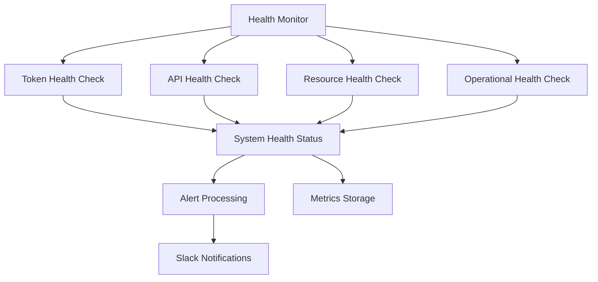

# SAFe PULSE Monitoring System

This module provides comprehensive system health monitoring, budget tracking, and operational intelligence for the SAFe PULSE Linear agent. It includes real-time monitoring, alerting, and integration with Slack notifications for operational awareness.

## Features

- **System Health Monitoring**: OAuth tokens, API rate limits, resource usage
- **Budget Monitoring**: API usage tracking, cost analysis, threshold alerts
- **Resource Monitoring**: Memory, disk, database connection monitoring
- **Operational Health**: Sync operations, planning activities, webhook processing
- **Behavior Health**: Autonomous behavior execution monitoring
- **Real-time Alerting**: Slack notifications for critical issues
- **Metrics Collection**: Historical data for trending and analysis

## Overview

The monitoring system provides comprehensive visibility into:

- **Token Health**: OAuth token expiration and refresh status
- **API Health**: Linear and Confluence API rate limits and response times
- **Resource Health**: System memory, disk usage, and database connections
- **Operational Health**: Sync operations, planning success rates, webhook processing
- **Budget Tracking**: API usage costs and resource consumption
- **Behavior Monitoring**: Autonomous behavior execution health and performance

## Architecture

### Core Components

```
src/monitoring/
├── health-monitor.ts              # Central health monitoring orchestrator
├── budget-monitor.ts              # API usage and cost tracking
├── resource-monitor.ts            # System resource monitoring
├── operational-health-monitor.ts  # Operational intelligence monitoring
└── ../agent/monitoring/
    └── health-monitor.ts          # Behavior execution monitoring
```

### Monitoring Flow



## API Reference

### Health Monitor

Central orchestrator for comprehensive system health monitoring:

```typescript
import { HealthMonitor } from './health-monitor';
import { HealthMonitorConfig } from '../types/monitoring-types';

// Configure health monitoring
const config: HealthMonitorConfig = {
  checkIntervalMs: 60000,
  tokenExpirationWarningDays: 7,
  apiUsageWarningPercentage: 80,
  memoryUsageWarningPercentage: 85,
  notificationsEnabled: true
};

// Create and start health monitor
const healthMonitor = new HealthMonitor(config);
await healthMonitor.startMonitoring();

// Get comprehensive health status
const healthStatus = await healthMonitor.checkSystemHealth();
```

### Budget Monitor

API usage and cost tracking with threshold alerts:

```typescript
import { BudgetMonitor } from './budget-monitor';
import { BudgetConfig } from '../types/monitoring-types';

// Configure budget monitoring
const budgetConfig: BudgetConfig = {
  apiLimits: {
    linear: {
      dailyLimit: 1000,
      monthlyLimit: 30000,
      warningThreshold: 80
    },
    confluence: {
      dailyLimit: 500,
      monthlyLimit: 15000,
      warningThreshold: 80
    }
  },
  resourceLimits: {
    memory: {
      maxUsageMB: 1024,
      warningThreshold: 85
    }
  }
};

// Create budget monitor
const budgetMonitor = new BudgetMonitor(budgetConfig);

// Record API usage
budgetMonitor.recordAPIUsage('linear', 'graphql', 1, 0.001);

// Get budget status
const budgetStatus = await budgetMonitor.getBudgetStatus();
```

### Resource Monitor

System resource monitoring with configurable thresholds:

```typescript
import { ResourceMonitor } from './resource-monitor';

// Configure resource monitoring
const resourceMonitor = new ResourceMonitor({
  checkInterval: 30000,
  memoryThreshold: 85,
  diskThreshold: 90,
  dbConnectionThreshold: 80,
  notificationsEnabled: true
});

// Start monitoring
resourceMonitor.start();

// Get current resource status
const resourceHealth = await resourceMonitor.performResourceCheck();
```

## Integration Guide

### Setting Up Monitoring

Initialize the complete monitoring system:

```typescript
import { HealthMonitor } from '../monitoring/health-monitor';
import { BudgetMonitor } from '../monitoring/budget-monitor';
import { ResourceMonitor } from '../monitoring/resource-monitor';

// Initialize monitoring components
const healthMonitor = new HealthMonitor(healthConfig);
const budgetMonitor = new BudgetMonitor(budgetConfig);
const resourceMonitor = new ResourceMonitor(resourceConfig);

// Start monitoring
await healthMonitor.startMonitoring();
budgetMonitor.startMonitoring();
resourceMonitor.start();

// Health check endpoint
app.get('/health', async (req, res) => {
  const health = await healthMonitor.checkSystemHealth();
  res.json(health);
});
```

### Integration with Agent System

Connect monitoring with the Enhanced Agent System:

```typescript
import { EnhancedAgentSystem } from '../agent/enhanced-agent-system';
import { HealthMonitor } from '../monitoring/health-monitor';

// Create agent system with monitoring
const agentSystem = new EnhancedAgentSystem({
  monitoring: {
    healthMonitor: new HealthMonitor(config),
    budgetMonitor: new BudgetMonitor(budgetConfig)
  }
});

// Monitor agent behavior health
const behaviorHealth = await agentSystem.getBehaviorHealth();
```

### Slack Integration

Configure Slack notifications for monitoring alerts:

```typescript
import { EnhancedSlackNotifier } from '../integrations/enhanced-slack-notifier';

// Configure Slack notifier
const slackNotifier = new EnhancedSlackNotifier({
  channels: {
    health: '#system-alerts',
    budget: '#budget-alerts',
    operations: '#ops-status'
  }
});

// Send health alert
await slackNotifier.sendSystemHealthAlert({
  component: 'api-rate-limit',
  status: 'warning',
  message: 'Linear API usage at 85%',
  severity: 'medium'
});
```

## Examples

### Complete Health Monitoring Setup

```typescript
import {
  HealthMonitor,
  BudgetMonitor,
  ResourceMonitor,
  OperationalHealthMonitor
} from '../monitoring';

// Comprehensive monitoring configuration
const monitoringConfig = {
  health: {
    checkIntervalMs: 60000,
    tokenExpirationWarningDays: 7,
    apiUsageWarningPercentage: 80,
    notificationsEnabled: true
  },
  budget: {
    apiLimits: {
      linear: { dailyLimit: 1000, monthlyLimit: 30000, warningThreshold: 80 },
      confluence: { dailyLimit: 500, monthlyLimit: 15000, warningThreshold: 80 }
    }
  },
  resources: {
    checkInterval: 30000,
    memoryThreshold: 85,
    diskThreshold: 90
  }
};

// Initialize monitoring system
class MonitoringSystem {
  private healthMonitor: HealthMonitor;
  private budgetMonitor: BudgetMonitor;
  private resourceMonitor: ResourceMonitor;

  constructor() {
    this.healthMonitor = new HealthMonitor(monitoringConfig.health);
    this.budgetMonitor = new BudgetMonitor(monitoringConfig.budget);
    this.resourceMonitor = new ResourceMonitor(monitoringConfig.resources);
  }

  async start(): Promise<void> {
    await this.healthMonitor.startMonitoring();
    this.budgetMonitor.startMonitoring();
    this.resourceMonitor.start();
  }

  async getSystemStatus(): Promise<any> {
    const [health, budget, resources] = await Promise.all([
      this.healthMonitor.checkSystemHealth(),
      this.budgetMonitor.getBudgetStatus(),
      this.resourceMonitor.performResourceCheck()
    ]);

    return { health, budget, resources };
  }
}
```

### Custom Health Checks

Implement custom health checks for specific components:

```typescript
import { BaseHealthCheck } from '../monitoring/base-health-check';

class CustomServiceHealthCheck extends BaseHealthCheck {
  async checkHealth(): Promise<HealthStatus> {
    try {
      // Custom health check logic
      const response = await this.customService.ping();
      
      return {
        status: response.ok ? 'healthy' : 'unhealthy',
        details: {
          responseTime: response.time,
          version: response.version
        }
      };
    } catch (error) {
      return {
        status: 'error',
        error: error.message
      };
    }
  }
}

// Register custom health check
healthMonitor.registerHealthCheck('custom-service', new CustomServiceHealthCheck());
```

### Budget Tracking Integration

Track API usage and costs across the system:

```typescript
// Track Linear API usage
budgetMonitor.recordAPIUsage('linear', 'issues.list', 1, 0.001);
budgetMonitor.recordAPIUsage('linear', 'issues.create', 1, 0.002);

// Track Confluence API usage
budgetMonitor.recordAPIUsage('confluence', 'content.get', 1, 0.0005);

// Track resource usage
budgetMonitor.recordResourceUsage('memory', 512, 'MB');
budgetMonitor.recordResourceUsage('disk', 2.5, 'GB');

// Get budget summary
const budgetSummary = await budgetMonitor.getBudgetSummary();
console.log('Daily API usage:', budgetSummary.apiUsage.daily);
console.log('Monthly costs:', budgetSummary.costs.monthly);
```

## Configuration

### Health Monitor Configuration

```typescript
const healthConfig: HealthMonitorConfig = {
  checkIntervalMs: 60000,                    // Check every minute
  tokenExpirationWarningDays: 7,             // Warn 7 days before expiration
  apiUsageWarningPercentage: 80,             // Warn at 80% API usage
  memoryUsageWarningPercentage: 85,          // Warn at 85% memory usage
  diskUsageWarningPercentage: 90,            // Warn at 90% disk usage
  dbConnectionWarningPercentage: 80,         // Warn at 80% DB connections
  alertThrottleMs: 300000,                   // Throttle alerts to 5 minutes
  notificationsEnabled: true,                // Enable Slack notifications
  environment: {
    development: {
      checkIntervalMs: 120000,               // Less frequent in dev
      notificationsEnabled: false            // No notifications in dev
    }
  }
};
```

### Budget Configuration

```typescript
const budgetConfig: BudgetConfig = {
  apiLimits: {
    linear: {
      dailyLimit: 1000,
      monthlyLimit: 30000,
      warningThreshold: 80
    },
    confluence: {
      dailyLimit: 500,
      monthlyLimit: 15000,
      warningThreshold: 80
    }
  },
  resourceLimits: {
    memory: {
      maxUsageMB: 1024,
      warningThreshold: 85
    },
    disk: {
      maxUsageGB: 10,
      warningThreshold: 90
    }
  },
  costTracking: {
    enabled: true,
    currency: 'USD',
    apiCosts: {
      linearCostPerCall: 0.001,
      confluenceCostPerCall: 0.0005
    }
  }
};
```

## Troubleshooting

### Common Issues

**Issue**: Health checks timing out
```typescript
// Solution: Increase timeout or optimize checks
const healthMonitor = new HealthMonitor({
  ...config,
  checkTimeoutMs: 10000  // Increase timeout to 10 seconds
});

// Use Promise.race for timeout protection
const healthCheck = Promise.race([
  this.checkComponentHealth(),
  this.timeoutPromise(5000, 'health-check-timeout')
]);
```

**Issue**: Too many alerts being sent
```typescript
// Solution: Implement alert throttling
const alertThrottleMs = 300000; // 5 minutes
const lastAlert = this.alertHistory.get(alertKey);
if (lastAlert && (Date.now() - lastAlert) < alertThrottleMs) {
  return; // Skip sending alert
}
```

**Issue**: Memory usage monitoring inaccurate
```typescript
// Solution: Use process.memoryUsage() for accurate readings
const memoryUsage = process.memoryUsage();
const memoryPercent = (memoryUsage.heapUsed / memoryUsage.heapTotal) * 100;
```

### Debugging Monitoring Issues

Enable detailed logging for monitoring components:

```typescript
// Debug health monitoring
logger.debug('Health check results', {
  tokenHealth: healthStatus.components.tokens,
  apiHealth: healthStatus.components.apis,
  resourceHealth: healthStatus.components.resources
});

// Debug budget tracking
logger.debug('Budget status', {
  dailyUsage: budgetStatus.apiUsage.daily,
  monthlyUsage: budgetStatus.apiUsage.monthly,
  costs: budgetStatus.costs
});
```

## Performance Guidelines

### Monitoring Optimization

1. **Efficient Health Checks**: Use parallel execution for independent checks
2. **Alert Throttling**: Prevent alert spam with appropriate throttling
3. **Metric Storage**: Store only essential metrics to prevent memory bloat
4. **Cleanup Routines**: Regularly clean up old monitoring data

### Resource Management

```typescript
// Efficient resource monitoring
class OptimizedResourceMonitor {
  private readonly MAX_HISTORY_SIZE = 1000;
  
  private cleanupOldMetrics(): void {
    // Keep only recent metrics
    const cutoff = Date.now() - (24 * 60 * 60 * 1000); // 24 hours
    this.metrics = this.metrics.filter(m => m.timestamp > cutoff);
  }
}
```

---

**The SAFe PULSE monitoring system provides comprehensive operational intelligence and proactive health management for enterprise-level reliability.** 📊🔍
