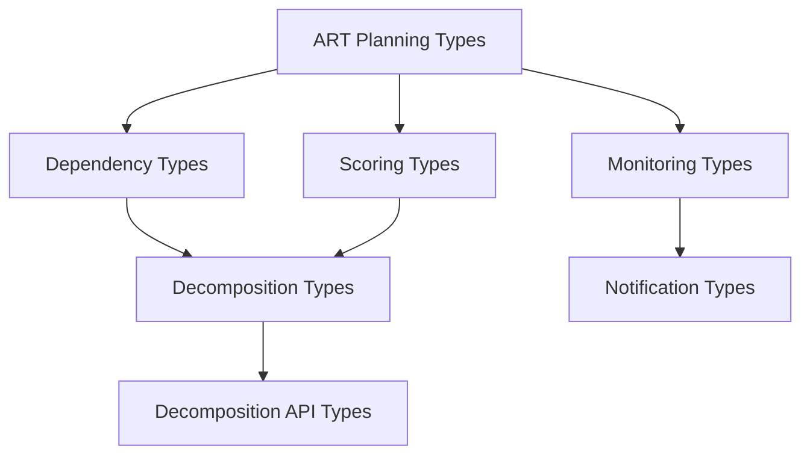

# SAFe PULSE Type System

This module provides comprehensive TypeScript type definitions for the SAFe PULSE Linear agent system. It includes types for ART planning, dependency management, story decomposition, monitoring, notifications, and scoring systems.

## Features

- **ART Planning Types**: Comprehensive types for Agile Release Train iteration planning
- **Dependency Management**: Types for dependency analysis and graph management
- **Story Decomposition**: Types for automated story breakdown and validation
- **Monitoring Types**: Health monitoring, budget tracking, and operational metrics
- **Notification Types**: Slack integration and notification coordination
- **Scoring Types**: WSJF scoring and business value analysis
- **API Integration**: Types for decomposition API and validation

## Overview

The type system provides the foundation for all SAFe PULSE operations, ensuring type safety and consistency across:

- **Planning Operations**: ART planning, iteration management, capacity allocation
- **Dependency Analysis**: Technical and business dependency mapping
- **Story Management**: Decomposition, scoring, and validation workflows
- **System Monitoring**: Health checks, resource monitoring, budget tracking
- **Integration Points**: Linear API, Slack notifications, webhook processing

## Architecture

### Core Type Categories

```
src/types/
├── art-planning-types.ts     # ART planning and iteration management
├── dependency-types.ts       # Dependency analysis and graph management
├── decomposition-types.ts    # Story decomposition engine types
├── decomposition-api-types.ts # API integration for decomposition
├── scoring-types.ts          # WSJF scoring and prioritization
├── monitoring-types.ts       # Health and resource monitoring
├── notification-types.ts     # Slack and notification systems
└── index.ts                 # Type exports
```

### Type Relationships



## API Reference

### ART Planning Types

Core types for Agile Release Train planning and iteration management:

```typescript
import { 
  ARTPlan, 
  IterationPlan, 
  ARTReadinessResult,
  ARTPlanSummary 
} from './art-planning-types';

// Create an ART plan
const artPlan: ARTPlan = {
  id: 'art-plan-1',
  name: 'Q1 2025 ART Plan',
  programIncrement: piModel,
  iterations: iterationPlans,
  teams: artTeams,
  dependencies: dependencyGraph,
  metadata: planMetadata
};

// Assess ART readiness
const readiness: ARTReadinessResult = {
  overallReadiness: 85,
  readinessLevel: 'ready',
  categories: readinessCategories,
  recommendations: ['Resolve dependency conflicts']
};
```

### Dependency Types

Types for comprehensive dependency analysis and management:

```typescript
import { 
  DependencyGraph, 
  DependencyRelationship,
  DependencyType,
  DependencyStrength 
} from './dependency-types';

// Define a dependency relationship
const dependency: DependencyRelationship = {
  id: 'dep-1',
  sourceId: 'story-1',
  targetId: 'story-2',
  type: DependencyType.BLOCKS,
  strength: DependencyStrength.HARD,
  confidence: 0.9,
  detectionMethod: DetectionMethod.SEMANTIC
};

// Create dependency graph
const graph: DependencyGraph = {
  workItems: workItemMap,
  dependencies: [dependency],
  metadata: { version: '1.0' }
};
```

### Story Decomposition Types

Types for automated story breakdown and validation:

```typescript
import { 
  DecompositionResult, 
  DecompositionConfig,
  StoryAnalysis 
} from './decomposition-types';

// Configure decomposition behavior
const config: DecompositionConfig = {
  maxStoryPoints: 5,
  minSubStories: 2,
  maxSubStories: 4,
  pointsDistributionStrategy: 'weighted',
  criteriaDistributionStrategy: 'thematic'
};

// Decomposition result
const result: DecompositionResult = {
  parentStory: originalStory,
  subStories: decomposedStories,
  decompositionRationale: 'Split by feature boundaries',
  pointsDistribution: [3, 2, 2],
  criteriaMapping: mappings
};
```

### Monitoring Types

Types for system health and resource monitoring:

```typescript
import { 
  SystemHealthStatus, 
  HealthMonitorConfig,
  BudgetConfig 
} from './monitoring-types';

// System health status
const health: SystemHealthStatus = {
  timestamp: Date.now(),
  isHealthy: true,
  overall: HealthStatus.HEALTHY,
  components: {
    tokens: tokenHealth,
    apis: apiHealth,
    resources: resourceHealth,
    operations: operationalHealth
  },
  alerts: []
};
```

## Integration Guide

### Setting Up Type Imports

```typescript
// Import specific types
import { ARTPlan, IterationPlan } from '../types/art-planning-types';
import { DependencyGraph } from '../types/dependency-types';
import { SystemHealthStatus } from '../types/monitoring-types';

// Import all notification types
import * as NotificationTypes from '../types/notification-types';
```

### Using Types in Components

```typescript
// ART Planning Component
export class ARTPlanner {
  async createPlan(config: ARTPlanningConfig): Promise<ARTPlan> {
    // Implementation using typed interfaces
  }
  
  async assessReadiness(plan: ARTPlan): Promise<ARTReadinessResult> {
    // Type-safe readiness assessment
  }
}

// Dependency Analysis Component  
export class DependencyMapper {
  async analyzeDependencies(workItems: WorkItem[]): Promise<DependencyGraph> {
    // Type-safe dependency analysis
  }
}
```

### Integration with SAFe PULSE Agent

```typescript
import { EnhancedAgentSystem } from '../agent/enhanced-agent-system';
import { ARTPlan, SystemHealthStatus } from '../types';

// Agent system with typed interfaces
const agentSystem = new EnhancedAgentSystem({
  planning: {
    artPlan: artPlan as ARTPlan,
    healthStatus: healthStatus as SystemHealthStatus
  }
});
```

## Examples

### Complete ART Planning Workflow

```typescript
import {
  ARTPlan,
  ARTPlanningConfig,
  DependencyGraph,
  DecompositionResult
} from '../types';

// 1. Configure ART planning
const planningConfig: ARTPlanningConfig = {
  programIncrementId: 'PI-2025-Q1',
  teamIds: ['team-1', 'team-2'],
  iterationCount: 5,
  capacityBuffer: 0.2
};

// 2. Create dependency graph
const dependencies: DependencyGraph = await dependencyMapper
  .analyzeDependencies(workItems);

// 3. Decompose large stories
const decompositions: DecompositionResult[] = await Promise.all(
  largeStories.map(story => decompositionEngine.decomposeStory(story))
);

// 4. Create ART plan
const artPlan: ARTPlan = await artPlanner.createPlan({
  ...planningConfig,
  dependencies,
  decomposedStories: decompositions.flatMap(d => d.subStories)
});
```

### Health Monitoring Integration

```typescript
import { 
  SystemHealthStatus, 
  HealthMonitorConfig,
  NotificationConfig 
} from '../types';

// Configure health monitoring
const healthConfig: HealthMonitorConfig = {
  checkIntervalMs: 60000,
  tokenExpirationWarningDays: 7,
  apiUsageWarningPercentage: 80,
  notificationsEnabled: true
};

// Monitor system health
const healthMonitor = new HealthMonitor(healthConfig);
const healthStatus: SystemHealthStatus = await healthMonitor.checkSystemHealth();

// Send notifications if needed
if (!healthStatus.isHealthy) {
  await slackNotifier.sendHealthAlert(healthStatus);
}
```

## Configuration

### Type System Configuration

The type system supports various configuration options:

```typescript
// Decomposition configuration
const decompositionConfig: DecompositionConfig = {
  maxStoryPoints: 5,
  pointsDistributionStrategy: 'fibonacci',
  preserveParentStory: true
};

// Monitoring configuration  
const monitoringConfig: HealthMonitorConfig = {
  checkIntervalMs: 30000,
  alertThrottleMs: 300000,
  notificationsEnabled: true
};

// Notification configuration
const notificationConfig: NotificationConfig = {
  channels: {
    planning: '#planning-ops',
    health: '#system-alerts',
    sync: '#sync-status'
  },
  thresholds: {
    tokenExpirationWarningDays: 7,
    apiUsageWarningPercentage: 80
  }
};
```

## Troubleshooting

### Common Type Issues

**Issue**: Type compatibility errors between different modules
```typescript
// Solution: Use proper type imports and assertions
import { ARTPlan } from '../types/art-planning-types';
const plan = data as ARTPlan;
```

**Issue**: Missing type definitions for new features
```typescript
// Solution: Extend existing interfaces
interface ExtendedARTPlan extends ARTPlan {
  customField: string;
}
```

**Issue**: Circular dependency in type imports
```typescript
// Solution: Use type-only imports
import type { DependencyGraph } from '../types/dependency-types';
```

### Validation Errors

**Issue**: Runtime type validation failures
```typescript
// Solution: Use type guards
function isValidARTPlan(data: any): data is ARTPlan {
  return data && typeof data.id === 'string' && Array.isArray(data.iterations);
}

if (isValidARTPlan(planData)) {
  // Safe to use as ARTPlan
}
```

## Performance Guidelines

### Type Usage Best Practices

1. **Import Only What You Need**
   ```typescript
   // Good: Specific imports
   import { ARTPlan, IterationPlan } from '../types/art-planning-types';
   
   // Avoid: Wildcard imports
   import * as Types from '../types';
   ```

2. **Use Type Assertions Carefully**
   ```typescript
   // Good: With validation
   const plan = isValidPlan(data) ? data as ARTPlan : null;
   
   // Avoid: Blind assertions
   const plan = data as ARTPlan;
   ```

3. **Leverage Type Guards**
   ```typescript
   function isDependencyGraph(obj: any): obj is DependencyGraph {
     return obj && Array.isArray(obj.dependencies);
   }
   ```

### Memory Optimization

- Use readonly types for immutable data
- Prefer interfaces over classes for pure data types
- Use union types instead of inheritance where appropriate

---

**The SAFe PULSE type system provides the foundation for enterprise-level type safety and consistency across all system components.** 🏗️📊
