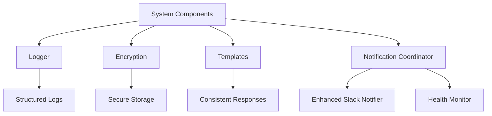

# SAFe PULSE Utility System

This module provides essential utility functions and helper services for the SAFe PULSE Linear agent system. It includes logging, encryption, response templates, and operational notification coordination to support consistent functionality across all system components.

## Features

- **Structured Logging**: Consistent JSON-based logging with metadata support
- **Secure Encryption**: AES-256 encryption for sensitive data storage
- **Response Templates**: Standardized agent communication templates
- **Notification Coordination**: Centralized operational intelligence coordination
- **Environment-Aware Configuration**: Automatic configuration based on deployment environment
- **Error Handling**: Consistent error handling patterns across utilities
- **Performance Optimization**: Efficient utility functions for common operations

## Overview

The utility system provides foundational services used throughout SAFe PULSE:

- **Logger**: Structured logging with levels (DEBUG, INFO, WARN, ERROR)
- **Encryption**: Secure storage and retrieval of sensitive tokens and data
- **Templates**: Consistent agent response formatting and communication
- **Notification Coordinator**: Unified interface for operational intelligence notifications
- **Common Patterns**: Reusable utility functions for frequent operations

## Architecture

### Core Components

```
src/utils/
├── logger.ts                           # Structured logging utility
├── encryption.ts                       # AES-256 encryption for sensitive data
├── templates.ts                        # Agent response templates
└── operational-notification-coordinator.ts  # Centralized notification management
```

### Utility Integration



## API Reference

### Logger

Structured logging with metadata support and multiple log levels:

```typescript
import * as logger from './logger';

// Basic logging
logger.info('System started successfully');
logger.warn('API usage approaching limit');
logger.error('Database connection failed');
logger.debug('Processing webhook payload');

// Logging with metadata
logger.info('Planning completed', {
  epicCount: 3,
  featureCount: 12,
  durationMinutes: 15.5
});

logger.error('API request failed', {
  endpoint: '/api/issues',
  statusCode: 500,
  error: error.message
});
```

### Encryption

Secure AES-256 encryption for sensitive data:

```typescript
import { encrypt, decrypt } from './encryption';

// Encrypt sensitive data
const accessToken = 'sensitive-access-token';
const encryptedToken = encrypt(accessToken);

// Store encrypted token safely
await database.storeToken(organizationId, encryptedToken);

// Decrypt when needed
const retrievedToken = await database.getToken(organizationId);
const decryptedToken = decrypt(retrievedToken);
```

### Response Templates

Standardized agent communication templates:

```typescript
import {
  createMentionResponse,
  createAssignmentResponse,
  createPlanningCompleteResponse,
  createErrorResponse
} from './templates';

// Agent mention response
const mentionResponse = createMentionResponse('john.doe');
// "Hi @john.doe, I'm the WTFB Planning Agent. I can help with SAFe planning activities."

// Assignment response
const assignmentResponse = createAssignmentResponse('jane.smith', 'LIN-123');
// "Hi @jane.smith, I've been assigned to issue LIN-123. I'll start working on this right away."

// Planning completion response
const completionResponse = createPlanningCompleteResponse('team.lead', 'EPIC-456', 8);
// "Hi @team.lead, I've completed the planning process for epic EPIC-456. I've created 8 features."
```

### Operational Notification Coordinator

Centralized notification management and coordination:

```typescript
import { OperationalNotificationCoordinator } from './operational-notification-coordinator';

// Create coordinator with environment-specific config
const coordinator = OperationalNotificationCoordinator.getInstance(
  OperationalNotificationCoordinator.createDefaultConfig('production')
);

// Send planning completion notification
await coordinator.notifyPlanningCompletion(
  'Q1 2025 Planning',
  3,    // epicCount
  12,   // featureCount
  45,   // storyCount
  5,    // enablerCount
  18.5, // durationMinutes
  'Confluence Planning Document'
);

// Send system health notification
await coordinator.notifySystemHealth({
  component: 'linear-api',
  status: 'warning',
  message: 'API usage at 85%',
  severity: 'medium'
});
```

## Integration Guide

### Setting Up Logging

Configure structured logging across your application:

```typescript
import * as logger from '../utils/logger';

// Application startup
logger.info('Application starting', {
  version: process.env.APP_VERSION,
  environment: process.env.NODE_ENV,
  port: process.env.PORT
});

// Error handling
try {
  await riskyOperation();
} catch (error) {
  logger.error('Operation failed', {
    operation: 'riskyOperation',
    error: error.message,
    stack: error.stack
  });
  throw error;
}

// Performance monitoring
const startTime = Date.now();
await performOperation();
const duration = Date.now() - startTime;

logger.info('Operation completed', {
  operation: 'performOperation',
  durationMs: duration,
  success: true
});
```

### Setting Up Encryption

Configure secure encryption for sensitive data:

```bash
# Environment configuration
ENCRYPTION_KEY=your-256-bit-encryption-key-here
```

```typescript
import { encrypt, decrypt } from '../utils/encryption';

// Token storage service
class TokenService {
  async storeToken(organizationId: string, token: string): Promise<void> {
    const encryptedToken = encrypt(token);
    await this.database.store(organizationId, encryptedToken);
    
    logger.info('Token stored securely', { organizationId });
  }

  async getToken(organizationId: string): Promise<string | null> {
    const encryptedToken = await this.database.get(organizationId);
    if (!encryptedToken) return null;

    const decryptedToken = decrypt(encryptedToken);
    logger.debug('Token retrieved and decrypted', { organizationId });
    
    return decryptedToken;
  }
}
```

### Using Response Templates

Implement consistent agent communication:

```typescript
import {
  createMentionResponse,
  createErrorResponse,
  createUpdateResponse
} from '../utils/templates';

// Webhook processor using templates
class IssueMentionProcessor {
  async process(notification: any): Promise<void> {
    const { issue, actor } = notification;
    
    try {
      // Process the mention
      await this.processAgentMention(issue);
      
      // Send success response using template
      const response = createMentionResponse(actor.name);
      await this.sendLinearComment(issue.id, response);
      
    } catch (error) {
      // Send error response using template
      const errorResponse = createErrorResponse(actor.name, error.message);
      await this.sendLinearComment(issue.id, errorResponse);
    }
  }
}
```

## Examples

### Complete Utility Integration

```typescript
import * as logger from '../utils/logger';
import { encrypt, decrypt } from '../utils/encryption';
import { createPlanningCompleteResponse } from '../utils/templates';
import { OperationalNotificationCoordinator } from '../utils/operational-notification-coordinator';

// Service class using all utilities
class PlanningService {
  private coordinator: OperationalNotificationCoordinator;

  constructor() {
    this.coordinator = OperationalNotificationCoordinator.getInstance(
      OperationalNotificationCoordinator.createDefaultConfig(
        process.env.NODE_ENV as 'development' | 'staging' | 'production'
      )
    );
  }

  async executePlanning(planningRequest: any): Promise<void> {
    const startTime = Date.now();
    
    logger.info('Planning execution started', {
      planningId: planningRequest.id,
      requestedBy: planningRequest.user
    });

    try {
      // Secure token handling
      const encryptedToken = await this.getStoredToken(planningRequest.organizationId);
      const accessToken = decrypt(encryptedToken);

      // Execute planning logic
      const result = await this.performPlanning(accessToken, planningRequest);

      // Log success
      const duration = Date.now() - startTime;
      logger.info('Planning execution completed', {
        planningId: planningRequest.id,
        durationMs: duration,
        epicCount: result.epicCount,
        featureCount: result.featureCount
      });

      // Send notifications
      await this.coordinator.notifyPlanningCompletion(
        planningRequest.title,
        result.epicCount,
        result.featureCount,
        result.storyCount,
        result.enablerCount,
        duration / 60000, // Convert to minutes
        planningRequest.sourceDocument
      );

      // Send Linear response
      const response = createPlanningCompleteResponse(
        planningRequest.user,
        result.epicId,
        result.featureCount
      );
      await this.sendLinearComment(planningRequest.issueId, response);

    } catch (error) {
      logger.error('Planning execution failed', {
        planningId: planningRequest.id,
        error: error.message,
        stack: error.stack
      });

      // Send error notification
      await this.coordinator.notifySystemHealth({
        component: 'planning-service',
        status: 'error',
        message: `Planning failed: ${error.message}`,
        severity: 'high'
      });

      throw error;
    }
  }
}
```

### Custom Utility Functions

Create custom utilities following established patterns:

```typescript
import * as logger from '../utils/logger';

// Custom utility for performance monitoring
export class PerformanceMonitor {
  private static timers = new Map<string, number>();

  static startTimer(operationId: string): void {
    this.timers.set(operationId, Date.now());
    logger.debug('Performance timer started', { operationId });
  }

  static endTimer(operationId: string): number {
    const startTime = this.timers.get(operationId);
    if (!startTime) {
      logger.warn('Performance timer not found', { operationId });
      return 0;
    }

    const duration = Date.now() - startTime;
    this.timers.delete(operationId);

    logger.info('Performance timer completed', {
      operationId,
      durationMs: duration
    });

    return duration;
  }
}

// Custom utility for data validation
export class ValidationUtils {
  static validateRequired(data: any, fields: string[]): void {
    const missing = fields.filter(field => !data[field]);
    
    if (missing.length > 0) {
      logger.error('Validation failed - missing required fields', {
        missingFields: missing,
        providedFields: Object.keys(data)
      });
      throw new Error(`Missing required fields: ${missing.join(', ')}`);
    }

    logger.debug('Validation passed', { validatedFields: fields });
  }
}
```

## Configuration

### Logger Configuration

```typescript
// Environment-based logging configuration
const getLogLevel = (): string => {
  switch (process.env.NODE_ENV) {
    case 'development':
      return 'DEBUG';
    case 'staging':
      return 'INFO';
    case 'production':
      return 'WARN';
    default:
      return 'INFO';
  }
};

// Custom logger configuration
const loggerConfig = {
  level: getLogLevel(),
  format: 'json',
  includeMetadata: true,
  includeTimestamp: true
};
```

### Encryption Configuration

```bash
# Required environment variables
ENCRYPTION_KEY=your-256-bit-encryption-key-here

# Optional: Key rotation
ENCRYPTION_KEY_ROTATION_ENABLED=true
ENCRYPTION_KEY_ROTATION_INTERVAL_DAYS=90
```

### Notification Coordinator Configuration

```typescript
const coordinatorConfig = {
  environment: 'production',
  healthMonitoring: {
    enabled: true,
    checkInterval: 120000  // 2 minutes
  },
  slackConfig: {
    channels: {
      planning: '#planning-ops',
      health: '#system-alerts'
    },
    throttling: {
      intervalMs: 300000,  // 5 minutes
      maxNotificationsPerInterval: 3
    }
  }
};
```

## Troubleshooting

### Common Issues

**Issue**: Encryption key not found
```typescript
// Solution: Verify environment variable
if (!process.env.ENCRYPTION_KEY) {
  logger.error('ENCRYPTION_KEY environment variable not set');
  throw new Error('Encryption key required');
}
```

**Issue**: Logging not appearing in production
```typescript
// Solution: Check log level configuration
logger.info('Debug info', { logLevel: process.env.LOG_LEVEL });
```

**Issue**: Notification coordinator not initialized
```typescript
// Solution: Ensure proper initialization
const coordinator = OperationalNotificationCoordinator.getInstance(
  OperationalNotificationCoordinator.createDefaultConfig('production')
);

if (!coordinator.isInitialized()) {
  await coordinator.initialize();
}
```

### Debugging Utilities

Enable detailed debugging for utility functions:

```typescript
// Debug logging configuration
logger.debug('Utility configuration', {
  encryptionEnabled: !!process.env.ENCRYPTION_KEY,
  logLevel: process.env.LOG_LEVEL,
  environment: process.env.NODE_ENV
});

// Debug encryption operations
logger.debug('Encryption operation', {
  operation: 'encrypt',
  dataLength: data.length,
  keyPresent: !!process.env.ENCRYPTION_KEY
});
```

## Performance Guidelines

### Utility Optimization

1. **Efficient Logging**: Use appropriate log levels to avoid performance impact
2. **Encryption Caching**: Cache encryption keys to avoid repeated environment variable access
3. **Template Reuse**: Reuse template functions instead of creating new ones
4. **Memory Management**: Clean up utility caches and temporary data

### Best Practices

```typescript
// Efficient logging
if (logger.isDebugEnabled()) {
  logger.debug('Expensive debug operation', expensiveDataGeneration());
}

// Efficient encryption
class EncryptionService {
  private static encryptionKey: string;
  
  private static getKey(): string {
    if (!this.encryptionKey) {
      this.encryptionKey = process.env.ENCRYPTION_KEY!;
    }
    return this.encryptionKey;
  }
}
```

---

**The SAFe PULSE utility system provides essential foundational services that ensure consistent, secure, and efficient operations across all system components.** 🔧⚙️
