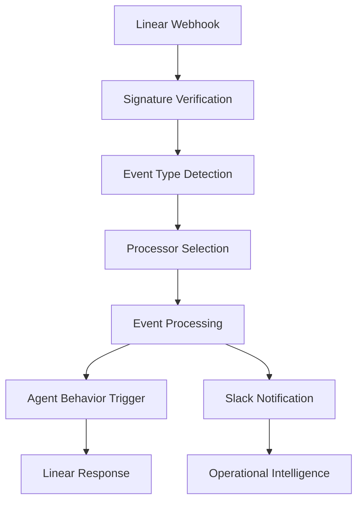

# SAFe PULSE Webhook System

This module provides comprehensive webhook handling for Linear API integration, enabling real-time event processing and agent behavior triggers. It includes signature verification, event processors, and seamless integration with the Enhanced Agent System.

## Features

- **Secure Webhook Verification**: HMAC-SHA256 signature validation with timestamp checking
- **Event Processing**: Specialized processors for different Linear webhook events
- **Agent Integration**: Direct integration with Enhanced Agent System and behavior triggers
- **Notification Coordination**: Slack notifications via operational notification coordinator
- **Real-time Processing**: Immediate response to Linear workspace events
- **Extensible Architecture**: Plugin-based processor system for new event types

## Overview

The webhook system serves as the primary integration point between Linear and the SAFe PULSE agent, processing:

- **@saafepulse Mentions**: Issue and comment mentions triggering agent responses
- **Issue Events**: Assignment, status changes, and new comments
- **Reaction Events**: Emoji reactions on issues and comments
- **Behavior Triggers**: Autonomous behavior activation based on webhook events
- **Notification Routing**: Operational intelligence notifications to Slack

## Architecture

### Core Components

```
src/webhooks/
├── handler.ts                    # Main webhook handler and routing
├── verification.ts               # Signature verification and security
└── processors/
    ├── base-processor.ts         # Abstract base class for processors
    ├── issue-mention.processor.ts # @saafepulse mentions in issues
    ├── issue-comment-mention.processor.ts # @saafepulse mentions in comments
    ├── issue-assignment.processor.ts # Issue assignment events
    ├── issue-status-change.processor.ts # Status change events
    ├── issue-reaction.processor.ts # Emoji reaction events
    ├── issue-new-comment.processor.ts # New comment events
    └── index.ts                  # Processor exports
```

### Event Flow



## API Reference

### Webhook Handler

Main webhook endpoint handler with signature verification and event routing:

```typescript
import { handleWebhook } from './handler';
import express from 'express';

const app = express();

// Webhook endpoint
app.post('/webhooks/linear', express.raw({ type: 'application/json' }), handleWebhook);
```

### Signature Verification

Secure webhook signature validation:

```typescript
import { verifyWebhookSignature } from './verification';

// Verify webhook signature
const isValid = verifyWebhookSignature(
  req.headers['linear-signature'] as string,
  req.body
);

if (!isValid) {
  return res.status(401).json({ error: 'Invalid signature' });
}
```

### Event Processors

Specialized processors for different webhook event types:

```typescript
import { 
  IssueMentionProcessor,
  IssueCommentMentionProcessor,
  IssueAssignmentProcessor 
} from './processors';

// Process issue mention
const mentionProcessor = new IssueMentionProcessor(
  linearClient,
  notificationCoordinator
);
await mentionProcessor.process(payload);
```

## Integration Guide

### Setting Up Webhook Endpoint

Configure your Express application to handle Linear webhooks:

```typescript
import express from 'express';
import { handleWebhook } from '../webhooks/handler';

const app = express();

// Raw body parser for webhook signature verification
app.use('/webhooks', express.raw({ type: 'application/json' }));

// Linear webhook endpoint
app.post('/webhooks/linear', handleWebhook);

// Start server
app.listen(3000, () => {
  console.log('Webhook server running on port 3000');
});
```

### Environment Configuration

Required environment variables:

```bash
# Webhook security
WEBHOOK_SECRET=your_linear_webhook_secret

# Linear API access
LINEAR_API_KEY=your_linear_api_key
LINEAR_ORGANIZATION_ID=your_organization_id

# Slack notifications
SLACK_BOT_TOKEN=your_slack_bot_token
SLACK_WEBHOOK_URL=your_slack_webhook_url
```

### Linear Webhook Configuration

Configure webhooks in Linear workspace settings:

```json
{
  "url": "https://your-domain.com/webhooks/linear",
  "secret": "your_webhook_secret",
  "events": [
    "Issue",
    "Comment", 
    "IssueLabel",
    "AppUserNotification"
  ]
}
```

## Examples

### Basic Webhook Processing

```typescript
import { Request, Response } from 'express';
import { handleWebhook } from '../webhooks/handler';

// Express route handler
app.post('/webhooks/linear', async (req: Request, res: Response) => {
  await handleWebhook(req, res);
});
```

### Custom Event Processor

Create a custom processor for new event types:

```typescript
import { BaseWebhookProcessor, AppUserNotification } from './base-processor';

export class CustomEventProcessor extends BaseWebhookProcessor {
  async process(notification: AppUserNotification): Promise<void> {
    const { issue, actor } = notification.notification;
    
    // Custom processing logic
    await this.processCustomEvent(issue, actor);
    
    // Send notification
    await this.notifySlack(
      'custom_event',
      'Custom Event Processed',
      `Custom event processed for ${issue?.identifier}`,
      issue?.url,
      actor?.name
    );
  }
  
  private async processCustomEvent(issue: any, actor: any): Promise<void> {
    // Implementation specific to your custom event
  }
}
```

### Agent Behavior Integration

Integrate webhook events with agent behaviors:

```typescript
import { processBehaviorWebhook } from '../agent/webhook-integration';

// In webhook handler
if (shouldTriggerBehaviors(type, action)) {
  await processBehaviorWebhook(req, res);
}
```

### Mention Processing

Handle @saafepulse mentions in issues and comments:

```typescript
import { IssueMentionProcessor } from './processors/issue-mention.processor';

const processor = new IssueMentionProcessor(linearClient, notificationCoordinator);

// Process mention event
await processor.process({
  action: 'issueMention',
  type: 'AppUserNotification',
  notification: {
    issue: {
      id: 'issue-id',
      identifier: 'LIN-123',
      title: 'Issue Title',
      description: '@saafepulse please analyze this issue',
      url: 'https://linear.app/issue/LIN-123'
    },
    actor: {
      id: 'user-id',
      name: 'John Doe'
    }
  }
});
```

## Configuration

### Webhook Security Configuration

```typescript
// Signature verification settings
const WEBHOOK_CONFIG = {
  secret: process.env.WEBHOOK_SECRET,
  timestampTolerance: 5 * 60 * 1000, // 5 minutes
  algorithm: 'sha256'
};

// Verify webhook with custom config
const isValid = verifyWebhookSignature(signature, body, WEBHOOK_CONFIG);
```

### Processor Configuration

```typescript
// Configure notification coordinator
const coordinatorConfig = OperationalNotificationCoordinator.createDefaultConfig(
  process.env.NODE_ENV as 'development' | 'staging' | 'production'
);

const notificationCoordinator = OperationalNotificationCoordinator.getInstance(
  coordinatorConfig
);

// Configure Linear client
const linearClient = new LinearClientWrapper(
  process.env.LINEAR_API_KEY!,
  process.env.LINEAR_ORGANIZATION_ID!
);
```

### Event Filtering

Configure which events trigger specific behaviors:

```typescript
// Event type filtering
const BEHAVIOR_EVENTS = [
  'Issue',
  'Comment',
  'IssueLabel'
];

const NOTIFICATION_EVENTS = [
  'AppUserNotification'
];

function shouldTriggerBehaviors(type: string, action: string): boolean {
  return BEHAVIOR_EVENTS.includes(type);
}
```

## Troubleshooting

### Common Issues

**Issue**: Webhook signature verification fails
```typescript
// Solution: Check webhook secret and timestamp
const webhookSecret = process.env.WEBHOOK_SECRET;
if (!webhookSecret) {
  console.error('WEBHOOK_SECRET environment variable not set');
}

// Verify timestamp is recent (within 5 minutes)
const timestampDate = new Date(parseInt(timestampValue) * 1000);
const now = new Date();
const fiveMinutesAgo = new Date(now.getTime() - 5 * 60 * 1000);
```

**Issue**: Processor not found for event type
```typescript
// Solution: Add processor to factory or handler
switch (action) {
  case 'newEventType':
    const processor = new NewEventProcessor(linearClient, notificationCoordinator);
    await processor.process(payload);
    break;
}
```

**Issue**: Agent behaviors not triggering
```typescript
// Solution: Check behavior registry initialization
const registry = getGlobalRegistry();
if (!registry) {
  logger.debug('Behavior system not initialized');
  // Initialize behavior registry
}
```

### Debugging Webhook Events

Enable detailed logging for webhook processing:

```typescript
// Debug webhook payload
logger.debug('Webhook received', {
  type: req.body.type,
  action: req.body.action,
  timestamp: req.body.createdAt,
  headers: req.headers
});

// Debug signature verification
logger.debug('Signature verification', {
  signature: req.headers['linear-signature'],
  bodyLength: req.body.length,
  secret: process.env.WEBHOOK_SECRET ? 'present' : 'missing'
});
```

### Error Recovery

Implement error recovery for failed webhook processing:

```typescript
try {
  await processor.process(payload);
} catch (error) {
  logger.error('Processor failed', { error: error.message, payload });
  
  // Send error notification
  await notificationCoordinator.notifyError(
    'webhook-processing',
    error.message,
    { payload, processor: processor.constructor.name }
  );
  
  // Continue processing other events
}
```

## Performance Guidelines

### Webhook Processing Optimization

1. **Async Processing**: Use async/await for non-blocking operations
2. **Error Isolation**: Isolate processor errors to prevent cascade failures
3. **Timeout Handling**: Implement timeouts for external API calls
4. **Rate Limiting**: Respect Linear API rate limits in processors

### Memory Management

```typescript
// Efficient payload processing
const processWebhook = async (payload: any) => {
  // Process only required fields
  const { type, action, data } = payload;
  
  // Clean up large objects after processing
  delete payload.largeData;
};
```

### Monitoring and Metrics

```typescript
// Track webhook processing metrics
const webhookMetrics = {
  totalProcessed: 0,
  successCount: 0,
  errorCount: 0,
  averageProcessingTime: 0
};

// Update metrics after processing
webhookMetrics.totalProcessed++;
webhookMetrics.successCount += success ? 1 : 0;
```

---

**The SAFe PULSE webhook system provides secure, real-time integration with Linear, enabling immediate agent responses and operational intelligence.** 🔗⚡
